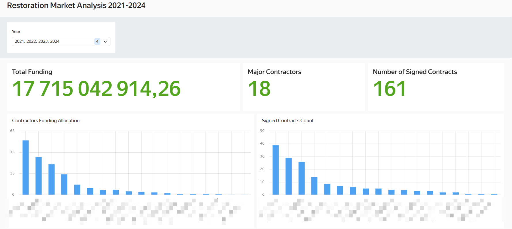
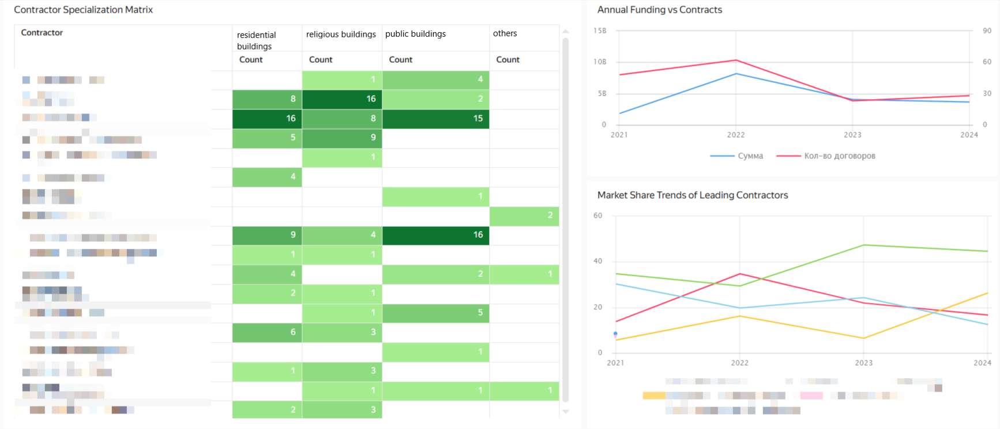
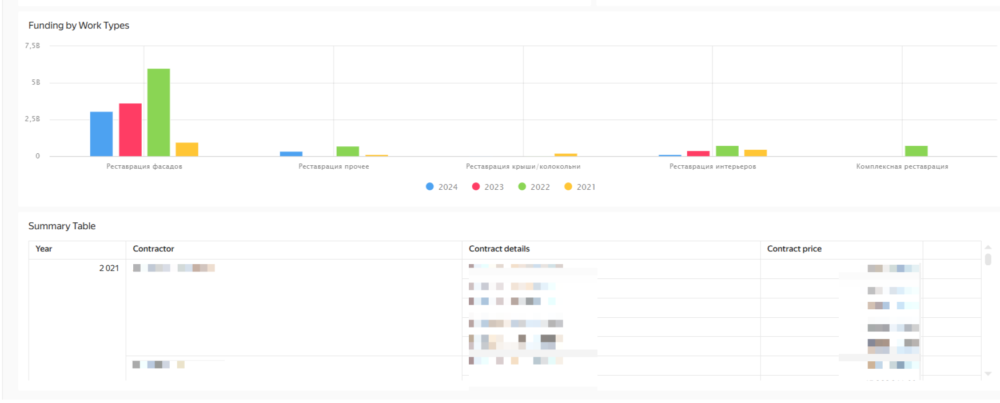

# Restoration Market Analytics Dashboard

Interactive dashboard for analyzing government funding of restoration works, tracking key contractors, and monitoring restoration services market dynamics.

## 📊 Dashboard Structure

### Filters and Key Metrics

*Year filter, funding volume, number of contractors and contracts*

### Contractors Analytics

*Distribution of object types, funding dynamics by year, market shares of TOP-6 companies*

### Funding Distribution and Detailed Table

*Allocation  by work types and detailed data table*

## 🛠 Technical Information

### Data Sources
- Unified Information System in the field of procurement

### Analysis Parameters
- **Minimum contract value**: 10000000 RUB
- **Geographic scope**: Regional market analysis  
- **Time frame**: 2021-2024
- **Data anonymization**: Contractor identities protected

## 📈 Key Analysis Capabilities

### Contractors Analysis
- Identification of market leaders in restoration services
- Analysis of company specialization
- Tracking market share dynamics

### Funding Analysis
- Monitoring total funding volume
- Analysis of distribution by work types

## 📁 Repository Structure

```
Restoration-Market-Analysis-Dashboard/
├── README.md
├── Screenshots/
│   ├── dashboard_top_section.png
│   ├── dashboard_contractors_analysis.png
│   └── dashboard_details.png
└── docs/
    └── documentation.md
```

*Dashboard developed in Yandex DataLens*
